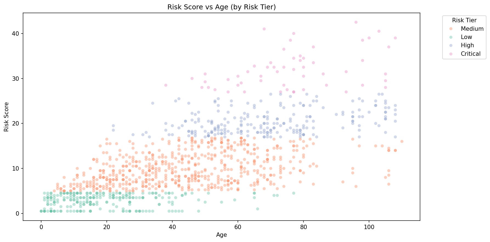
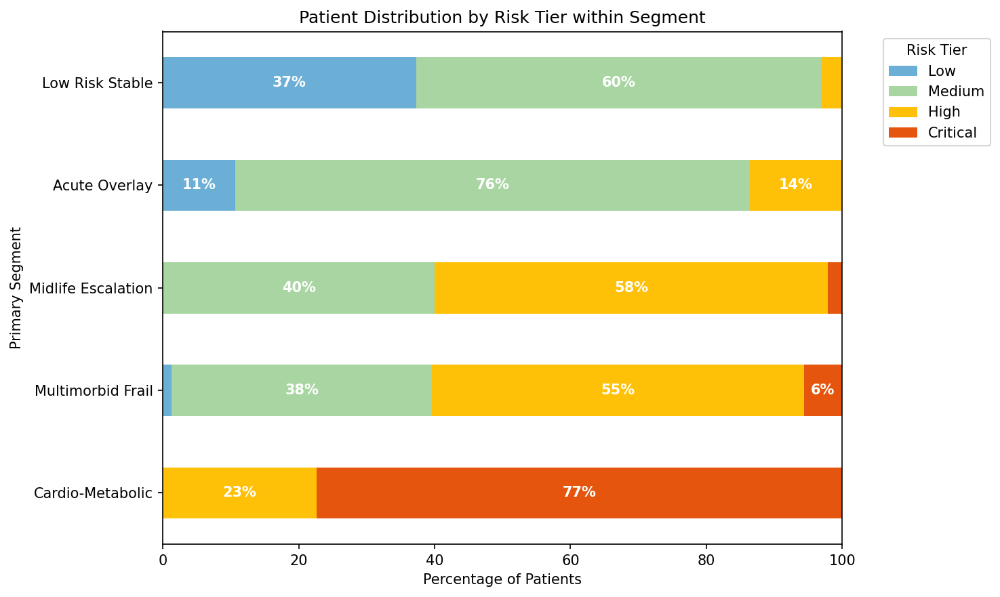
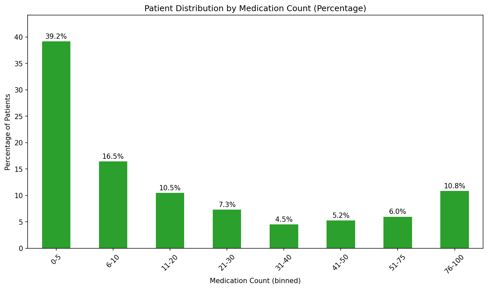
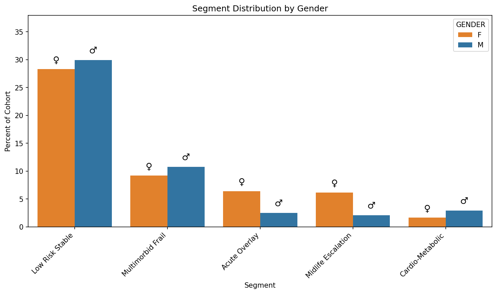
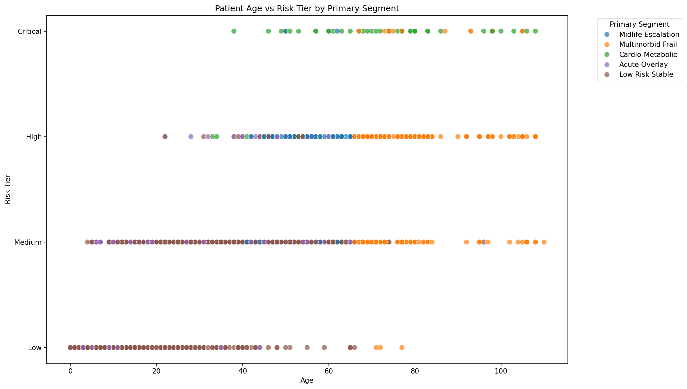
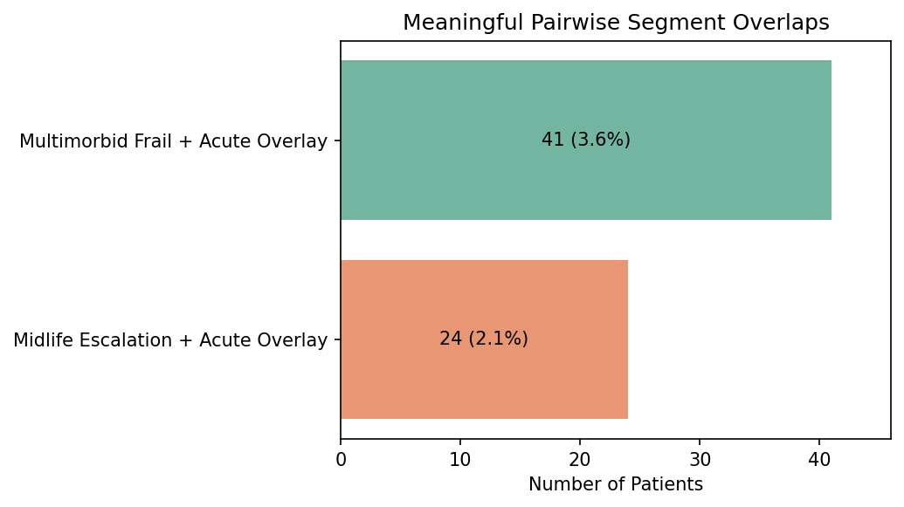

# Clinical Risk Analysis Pipeline v2.1

> An NHS-facing health informatics portfolio project built in Python and JupyterLab.  
> Synthetic EHR data (Synthea) · SNOMED CT · UK ICD-10 5th Edition · FHIR R4  
> 1,152 patients · 18,337 FHIR resources · Validated against the official HL7 FHIR validator

---

## What This Project Demonstrates

- End-to-end traceability from raw EHR → risk score → segment → FHIR output
- This pipeline was built to demonstrate the intersection of clinical reasoning and data engineering in a realistic NHS population health context. It is not a tutorial or a data science exercise — it is a modular, auditable, end-to-end system that reflects how a clinical informatics pipeline can be structured for population risk stratification.

Specifically it demonstrates:

- Clinical terminology architecture: SNOMED CT used natively throughout, ICD-10 reserved for the output layer — matching NHS interoperability standards
- Multi-layer risk scoring with documented clinical rationale for every design decision
- Patient segmentation that produces actionable clinical profiles, not just numerical tiers
- UK ICD-10 5th Edition mapping — the NHS coding standard, not ICD-10-CM
- FHIR R4 bundle construction with dual terminology coding, validated structurally and against the official HL7 validator
- Modular pipeline architecture with a single orchestrator entry point

---

## Synthetic Data Disclaimer

All data used in this project is synthetic, generated by [Synthea](https://synthetichealth.github.io/synthea/). No real patient data was used at any stage. This project is not validated for clinical use and should not be used in any clinical decision-making context.

---

## Pipeline Architecture

```
data/conditions.csv          data/patients.csv
data/medications.csv         data/encounters.csv
        │
        ▼
┌─────────────────────────────────────────────────────┐
│  Sprint 1 · build_snomed_universe.py                │
│  129 SNOMED codes → 15 clinical categories          │
│  outputs: patient_conditions_wide.csv               │
│           patient_conditions_long.csv               │
└─────────────────────────┬───────────────────────────┘
                          │
                          ▼
┌─────────────────────────────────────────────────────┐
│  Sprint 2 · compute_risk_scores.py                  │
│  6-layer risk scoring → 4 risk tiers                │
│  outputs: patient_risk_scores.csv                   │
│           tier_summary.csv                          │
└─────────────────────────┬───────────────────────────┘
                          │
                          ▼
┌─────────────────────────────────────────────────────┐
│  Sprint 3 · assign_segments.py                      │
│  5 clinical segments with priority-based assignment │
│  outputs: patient_segments.csv                      │
│           segment_summary.csv                       │
└─────────────────────────┬───────────────────────────┘
                          │
                          ▼
┌─────────────────────────────────────────────────────┐
│  Sprint 4 · map_icd10.py                            │
│  SNOMED → UK ICD-10 5th Edition output layer        │
│  outputs: conditions_icd10_mapped.csv               │
│           patient_risk_scores.csv (enriched)        │
└─────────────────────────┬───────────────────────────┘
                          │
                          ▼
┌─────────────────────────────────────────────────────┐
│  Sprint 5 · build_fhir_bundle.py                    │
│  FHIR R4 Bundle · 4 resource types · 18,337 entries │
│  outputs: fhir/clinical_risk_bundle.json            │
└─────────────────────────────────────────────────────┘
```

---

## Repository Structure

```
clinical-risk-analysis-v2/
├── README.md
├── requirements.txt
├── run_pipeline.py                          ← end-to-end orchestrator
├── .gitignore
│
├── data/
│   └── reference/                          ← tracked reference files only
│       ├── snomed_to_icd10_map.csv
│       ├── snomed_to_icd10_map.json
│       └── uk_icd10_reference.csv
│
├── src/
│   ├── build_snomed_universe.py
│   ├── compute_risk_scores.py
│   ├── assign_segments.py
│   ├── map_icd10.py
│   └── build_fhir_bundle.py
│
├── notebooks/
│   ├── 01_snomed_conditions.ipynb
│   ├── 02_risk_scorer.ipynb
│   ├── 03_segmentation.ipynb
│   ├── 04_icd10_mapper.ipynb
│   └── 05_fhir_exporter.ipynb
│
├── outputs/
│   ├── snomed_conditions_universe.csv
│   ├── patient_conditions_wide.csv
│   ├── patient_conditions_long.csv
│   ├── patient_risk_scores.csv
│   ├── patient_segments.csv
│   ├── segment_summary.csv
│   ├── tier_summary.csv
│   ├── category_by_tier.csv
│   ├── conditions_icd10_mapped.csv
│   ├── intermediate/
│   │   ├── conditions_icd10_cleaned.csv
│   │   └── conditions_encounter_merged.csv
│   ├── figures/
│   ├── fhir/
│   │   └── clinical_risk_bundle.json
│   └── validation/
│       └── fhir_validation_report.txt
│
└── docs/
    ├── sprint_1_log.md
    ├── sprint_2_log.md
    ├── sprint_3_log.md
    ├── sprint_4_log.md
    ├── sprint_5_log.md
    ├── methodology.md
    └── limitations.md
```

Raw Synthea CSV files are excluded via `.gitignore` (`data/*.csv`). Reference files under `data/reference/` are tracked as they are manually curated and version-controlled by design.

---

## Quickstart

```bash
git clone https://github.com/your-username/clinical-risk-analysis-v2.git
cd clinical-risk-analysis-v2
pip install -r requirements.txt
```

Place Synthea output files in `data/`:
- `conditions.csv`
- `patients.csv`
- `medications.csv`
- `encounters.csv`

Run the full pipeline:

```bash
python run_pipeline.py
```

Or run each sprint notebook individually in `notebooks/`.

---

## Expected Runtime

- Full pipeline: ~40–60 seconds
- Hardware used: Apple M1 / 8GB

---

## Sprint 1 · SNOMED Condition Mapping

**What it does:** Extracts all unique SNOMED CT codes from the raw conditions data and maps them to 15 clinical categories via a manually curated lookup table. Produces patient-level wide format (binary category flags) and long format (patient-category pairs) outputs consumed by all downstream sprints.

**Clinical categories (15):**

| Category | Weight in Sprint 2 | Codes |
|---|---|---|
| CARDIOVASCULAR | 4 | 10 |
| DIABETES & COMPLICATIONS | 4 | 7 |
| ENDOCRINOLOGY | 3 | 7 |
| NEUROLOGY / CEREBROVASCULAR | 3 | 13 |
| NEPHROLOGY & ELECTROLYTES DISORDERS | 3 | 6 |
| PULMONOLOGY | 2 | 11 |
| PSYCHIATRY | 2 | 3 |
| DRUG INTERACTIONS / ADDICTION | 2 | 3 |
| GENERAL SURGERY | 1 | 11 |
| ORTHOPEDICS & RHEUMATOLOGY | 1 | 18 |
| GYNECOLOGY & OBSTETRICS | 1 | 8 |
| TRAUMA | 0.5 | 12 |
| MALE REPRODUCTIVE | 0.5 | 3 |
| ENT | 0.5 | 10 |
| OTHER | 0.5 | 7 |

**Key design decisions:**

- Mapping is performed on SNOMED code (integer), not description string. An earlier implementation merged on both CODE and DESCRIPTION — this caused 302 silent unmatched rows for Hypertension (SNOMED 59621000) due to a display name discrepancy between Synthea and the universe CSV. Fixed to code-only merge.
- SNOMED CT is used natively throughout the entire pipeline. ICD-10 is reserved for the output layer only (Sprint 4). This preserves clinical granularity and matches NHS interoperability architecture.
- PSYCHIATRY and DRUG INTERACTIONS / ADDICTION were retained as distinct categories despite low code counts (3 each) due to their independent clinical and analytical significance. Four lower-acuity categories (DENTAL, ALLERGIC REACTION, HEMATOLOGY, DERMATOLOGY) were consolidated into OTHER with documented rationale.
- An `is_acute` binary flag was added to the universe CSV, consumed in Sprint 3 for the Acute Overlay segment.

**Outputs:** `snomed_conditions_universe.csv` (129 codes, 15 categories), `patient_conditions_wide.csv`, `patient_conditions_long.csv`

---

## Sprint 2 · Multi-Layer Risk Scoring

**What it does:** Scores each patient across six independent layers, producing a single composite risk score and a four-tier risk classification. Tier thresholds are derived from the 75th and 95th percentiles of the cohort score distribution.

**Risk score formula:**

```
risk_score = base_score
           + multimorbidity_tier_bonus
           + age_adjustment
           + polypharmacy_bonus
           + utilisation_bonus
           + recurrence_bonus
```

**Layer breakdown:**

**Layer 1 — Base score**
Category presence (binary) multiplied by category weight, summed across all categories. Weights were derived from clinical intuition and reflect relative NHS resource burden — CARDIOVASCULAR and DIABETES & COMPLICATIONS at 4, representing the highest-acuity chronic disease combinations, through to ENT and TRAUMA at 0.5, which are typically episodic and lower-acuity. This is a clinician-defined weighting scheme, not a statistically derived one, and is intentionally transparent and auditable.

**Layer 2 — Multimorbidity tier bonus**
A bonus applied on top of the base score to capture the non-linear complexity of multiple concurrent conditions. A patient with five conditions is disproportionately harder to manage than five patients with one condition each — a principle explicitly recognised in NICE multimorbidity guidance.

| Categories present | Bonus |
|---|---|
| ≥ 2 | +1 |
| ≥ 5 | +2 |
| ≥ 8 | +3 |

**Layer 3 — Age adjustment**
Applied only to the five highest-risk categories: CARDIOVASCULAR, DIABETES & COMPLICATIONS, NEUROLOGY / CEREBROVASCULAR, ENDOCRINOLOGY, NEPHROLOGY & ELECTROLYTES DISORDERS. Age is an independent risk amplifier for these conditions specifically — it would be clinically inappropriate to age-penalise a patient for an ENT condition.

| Age band | Multiplier |
|---|---|
| 0–40 | × 1.0 |
| 41–65 | × 1.25 |
| 66+ | × 1.50 |

Age is calculated from a fixed reference date of 25 April 2020 — the latest condition date in the Synthea dataset — ensuring consistency across all patients.

**Layer 4 — Polypharmacy bonus**
High medication counts are a recognised independent risk marker in NHS practice. Medication count is capped at 100 to prevent a small number of extreme outliers from distorting scores.

| Medications (capped at 100) | Bonus |
|---|---|
| ≥ 25 | +1 |
| ≥ 50 | +2 |
| ≥ 100 | +3 |

**Layer 5 — Utilisation bonus**
Total encounter count as a proxy for healthcare instability. Patients with high total encounters are signalling that their conditions are not well controlled in standard care.

| Encounters | Bonus |
|---|---|
| ≥ 20 | +1 |
| ≥ 50 | +2 |
| ≥ 100 | +3 |

**Layer 6 — Recurrence bonus**
For each of the five age-sensitive categories, if a patient has three or more encounters recorded within that specific category, they receive +0.5. This distinguishes active recurring conditions from historical or resolved ones.

**Risk tier distribution:**

| Tier | Threshold | Patients | % |
|---|---|---|---|
| Critical | ≥ 27 (> 95th percentile) | 56 | 4.9% |
| High | ≥ 17 (> 75th percentile) | 227 | 19.7% |
| Medium | ≥ 5 | 605 | 52.5% |
| Low | < 5 | 264 | 22.9% |







**Outputs:** `patient_risk_scores.csv`, `tier_summary.csv`, `category_by_tier.csv`

---

## Sprint 3 · Patient Segmentation

**What it does:** Assigns each patient to a clinical segment based on the pattern driving their risk. Where a patient qualifies for multiple segments, priority-based assignment determines the primary label. All qualifying segments are preserved in the `all_segments` column — no clinical information is discarded.

**The five segments:**

**Cardio-Metabolic** (Priority 1)
Patients with both CARDIOVASCULAR and DIABETES & COMPLICATIONS present simultaneously. This co-occurrence is one of the most well-established high-risk clinical combinations in NHS practice — each condition actively amplifies the other. It earns the highest priority because it is the most specific and clinically actionable segment, pointing directly to a defined management pathway.

**Multimorbid Frail** (Priority 2)
Patients in the 66+ age band (the third age band as defined in the Sprint 2 scoring system) with three or more clinical categories, excluding those already classified as Cardio-Metabolic. Targets the NHS frailty cohort — patients whose compounding age-related vulnerability and multi-system disease burden exceeds the capacity of condition-specific care pathways. The Cardio-Metabolic exclusion ensures the more specific segment label takes precedence.

**Midlife Escalation** (Priority 3)
Patients in the 41–65 age band (the second age band from Sprint 2) with more than 50 total encounters. Identifies opportunities for primary prevention and long-term condition (LTC) management in working-age adults whose utilisation pattern signals accumulating complexity — before it reaches frailty-tier severity. Early identification in this cohort aligns with NHS Long Term Plan priorities around proactive care and reducing avoidable escalation.

**Acute Overlay** (Priority 4)
Patients with five or more distinct acute SNOMED codes present. Captures patients whose clinical picture is dominated by acute conditions regardless of chronic disease burden — a different risk profile from chronic complexity, requiring different management.

**Low Risk Stable** (Default)
Patients not meeting the criteria for any named segment. Appropriate for standard primary care management without proactive intervention.

**Segment distribution:**





**Pairwise overlaps — only two combinations were clinically significant:**



| Overlap | Patients | % |
|---|---|---|
| Multimorbid Frail + Acute Overlay | 41 | 3.6% |
| Midlife Escalation + Acute Overlay | 24 | 2.1% |

Cardio-Metabolic does not appear in overlap analysis because Multimorbid Frail structurally excludes it by design. Other combinations produced negligible counts.

**Reading segments with risk tiers:**
Segments and risk tiers are designed to be read together, not independently. A Multimorbid Frail patient in Critical or High tier warrants proactive intervention. The same segment in Medium or Low tier likely reflects minor category inflation — monitor only. This two-dimensional view is more clinically precise than either dimension alone and removes the need for additional category exclusion logic in the segmentation rules.

**Validation:** 1,152 patients, 0 unassigned — confirmed by assertion.

**Outputs:** `patient_segments.csv`, `segment_summary.csv`

---

## Sprint 4 · ICD-10 Mapping

**What it does:** Maps every SNOMED code to its UK ICD-10 5th Edition equivalent, enriching both the condition-level data and the patient-level risk score table. The mapping is explicit, manually curated, and one-to-one at the SNOMED level — multiple SNOMED codes can legitimately resolve to the same ICD-10 code where the ICD-10 classification does not carry the same level of specificity.

**Key design decisions:**

- UK ICD-10 5th Edition is used throughout — not ICD-10-CM (US standard). The editions differ in code structure and preferred terminology. Using the wrong edition would immediately signal unfamiliarity with NHS clinical coding practice.
- SNOMED category assignments reflect clinical risk relevance, not ICD-10 chapter structure. Hyperlipidaemia (E78.5) sits in ICD-10 Chapter IV (endocrine/metabolic) but is assigned to CARDIOVASCULAR in the SNOMED layer as a cardiovascular risk factor. The two layers serve different purposes and are not required to be structurally consistent with each other.
- Tobacco use (SNOMED 449868002) maps to F17.1 — a mental and behavioural disorder in ICD-10 — but is assigned to PULMONOLOGY in the SNOMED layer as a pulmonary risk factor. ICD-10 chapter placement does not override clinical categorisation logic.
- Hypertension (SNOMED 59621000) description corrected to canonical preferred term "Essential hypertension (disorder)". Synthea uses the shortened display name "Hypertension", which caused silent merge failure on the description-key join used in Sprint 5. The correction aligns the universe with the SNOMED CT international release preferred term.
- A Z99.9 fallback row is included for any unmapped code. The fallback check returned PASSED — it was never triggered. Its presence is a defensive coding practice, not an admission of incomplete mapping.
- Mapping is also exported as JSON (`snomed_to_icd10_map.json`) as a forward-looking reference artifact for future API or terminology service integrations.

**Outputs:** `conditions_icd10_mapped.csv`, `patient_risk_scores.csv` (enriched with `icd10_codes_all`), `data/reference/snomed_to_icd10_map.csv`, `data/reference/snomed_to_icd10_map.json`, `data/reference/uk_icd10_reference.csv`

---

## Sprint 5 · FHIR R4 Bundle Export

**What it does:** Constructs a FHIR R4 collection bundle from the full pipeline output, producing four resource types: Patient, Encounter, Condition, and RiskAssessment. The bundle was validated structurally with a custom validator and confirmed against the official HL7 FHIR validator.

**Bundle summary:**

| Resource | Count |
|---|---|
| Patient | 1,152 |
| Encounter | 7,657 |
| Condition | 8,376 |
| RiskAssessment | 1,152 |
| **Total entries** | **18,337** |

**Key design decisions:**

**Dual terminology coding on every Condition resource**
Each Condition carries two coding entries — SNOMED CT (`userSelected: true`, clinician-facing) and UK ICD-10 (`userSelected: false`, administrative). This mirrors NHS interoperability architecture where SNOMED is the primary clinical terminology and ICD-10 is the administrative classification layer.

**Bundle type: collection**
A `collection` bundle groups resources for export, sharing, or reporting — no server-side processing is implied. A `transaction` bundle would be appropriate only if submitting to a FHIR server for atomic ingestion. This pipeline produces a reporting artefact, not a server transaction.

**clinicalStatus derived from STOP date**
Condition `clinicalStatus` is set to `active` where no STOP date is recorded, and `resolved` where a STOP date is present. This is the most clinically defensible inference available from Synthea data without access to explicit status fields.

**ICD-10 display corrections (`DISPLAY_CORRECTIONS`)**
The SNOMED→ICD-10 mapping table was authored with internally annotated descriptions for pipeline clarity — for example, `N39.0` was described as "Urinary tract infection - Escherichia coli" to distinguish it from other UTI codes sharing the same ICD-10 code. In a FHIR Condition resource, the `display` field must carry the official terminology display name, not an internal annotation.

The worked example: SNOMED 301011002 is a UTI caused specifically by E. coli — that granularity is preserved in the SNOMED coding layer where `userSelected: true`. However `N39.0` in UK ICD-10 means "Urinary tract infection, site not specified" — the ICD-10 standard does not carry organism-level specificity at this code. Displaying "Escherichia coli" under an `N39.0` code would misrepresent the ICD-10 standard to any consuming system. The display correction replaces the annotation with the canonical UK ICD-10 preferred term.

**SNOMED description corrections (`DESCRIPTION_CORRECTIONS`)**
Four SNOMED descriptions in the universe were corrected to their canonical SNOMED CT preferred terms before bundle construction. Synthea uses abbreviated display names for some codes — using non-preferred terms in FHIR Condition resources would be terminologically incorrect. For example, Synthea's "Hypertension" is corrected to "Essential hypertension (disorder)" — the canonical preferred term for SNOMED 59621000.

**`probabilityDecimal` — schema-conformant design decision**
The FHIR R4 StructureDefinition for `probabilityDecimal` defines the field as a decimal type with no enforced range invariant. The 0–1 range appears in the narrative guidance only — it is not a validation constraint. The raw pipeline risk score (e.g. 22.5) is carried directly in this field as a deliberate choice: it preserves the full scoring resolution and makes the risk value immediately interpretable without normalisation. This was confirmed as schema-conformant by passing the official HL7 FHIR validator. A production implementation targeting a live FHIR server would either normalise to 0–1 or carry the raw score in a custom extension alongside a normalised probability.

**`fullUrl` uses a local pipeline URI**
`http://clinical-risk-pipeline/` is used as the base URI for all `fullUrl` values. This is not a real NHS endpoint — it is a locally scoped identifier appropriate for a collection bundle that is not being submitted to a FHIR server.

**Validation summary:**
- Structural validation: all required fields, date formats (ISO 8601), dual coding presence, subject references, fullUrl uniqueness — all PASSED
- Cross-validation against source data: patient counts, condition counts, RiskAssessment counts, SNOMED code coverage, patient ID consistency, risk score consistency, segment consistency — all PASSED
- Official HL7 FHIR validator: PASSED

**Outputs:** `outputs/fhir/clinical_risk_bundle.json`, `outputs/validation/fhir_validation_report.txt`

---

## Cohort Summary

| Metric | Value |
|---|---|
| Total patients | 1,152 |
| SNOMED codes mapped | 129 |
| Clinical categories | 15 |
| Risk score range | 0.5 – 42.5 |
| Mean risk score | 11.44 |
| Critical tier | 56 (4.9%) |
| High tier | 227 (19.7%) |
| Medium tier | 605 (52.5%) |
| Low tier | 264 (22.9%) |
| FHIR resources | 18,337 |

---

## Known Limitations

- **Synthetic data:** All outputs are derived from Synthea-generated synthetic EHR data. The clinical distributions and risk scores reflect synthetic population patterns, not real NHS epidemiology.
- **Midlife Escalation encounter threshold:** Total encounter count in Synthea includes routine wellness visits, immunisations, and administrative contacts. A real NHS implementation would filter to unplanned or condition-related encounters. This is a synthetic data constraint, not a modelling error.
- **Age reference date:** Patient ages are calculated from a fixed reference date (25 April 2020) rather than a dynamic current date, ensuring reproducibility across pipeline runs.
- **Segmentation category inflation:** `category_count` in Multimorbid Frail and Midlife Escalation counts all 15 categories equally, including minor ones such as MALE REPRODUCTIVE and ENT. A patient qualifying on minor categories alone will have a low risk tier. The correct clinical interpretation requires reading segment alongside risk tier — the two dimensions together provide the precision that either dimension alone cannot.
- **FHIR encounter class:** All encounters are coded as `AMB` (ambulatory). Synthea does not consistently distinguish encounter types in a way that would support more granular class assignment.
- **ICD-10 mapping granularity:** Some SNOMED codes with high clinical specificity (e.g. organism-specific infections) map to unspecified ICD-10 codes because the UK ICD-10 5th Edition does not carry equivalent granularity at that level. Specificity is preserved in the SNOMED layer.

---

## Future Scope

- **NHS Digital Terminology Server integration:** Automate SNOMED→ICD-10 mapping via [Ontoserver](https://ontoserver.csiro.au/) or the NHS SNOMED CT browser API, replacing the manually curated CSV with a live terminology service query. This would extend coverage beyond the current 129-code universe and ensure mappings stay current with SNOMED CT release cycles.
- **SMART on FHIR deployment:** Package the risk scoring and segmentation logic as a SMART on FHIR application, allowing clinicians to view patient risk scores and segment assignments directly within an EPR (Electronic Patient Record) such as Epic or Cerner — without leaving the clinical workflow.
- **Risk score normalisation:** Implement a normalised 0–1 probability layer alongside the raw score in the FHIR RiskAssessment resource, using a custom extension. This would make the output fully interoperable with FHIR-native risk assessment tools.
- **Encounter type filtering:** Replace total encounter count in Midlife Escalation with a filtered count restricted to unplanned or condition-related encounters — as would be possible with real NHS SUS (Secondary Uses Service) data.
- **Longitudinal scoring:** Extend the pipeline to score patients at multiple time points, enabling trajectory analysis — identifying patients whose risk is increasing rather than simply high.

---

## Technical Stack

| Component | Detail |
|---|---|
| Language | Python 3.x |
| Environment | JupyterLab |
| Core libraries | pandas, json, os, datetime |
| Visualisation | matplotlib, seaborn |
| Clinical terminology | SNOMED CT, UK ICD-10 5th Edition |
| Interoperability standard | FHIR R4 |
| Data source | Synthea synthetic EHR generator |
| Validation | Custom structural validator + official HL7 FHIR validator |

---

## Project Background

This project was built as a portfolio demonstration of NHS-facing health informatics capability. Clinical reasoning decisions — terminology architecture, scoring weights, segmentation criteria, ICD-10 mapping choices — were made by the author, an MBBS graduate. Python implementation was developed iteratively in JupyterLab with a sprint-based methodology, each sprint validated before the next began.

Sprint logs documenting design decisions, known limitations, and validation results are available in `docs/`.

### Clinical Safety and Governance

While this is a synthetic demonstration project, the architecture follows the spirit of DCB0129 clinical safety standards — specifically regarding the auditability of the risk-scoring logic, the transparency of every design decision, and the preservation of clinical granularity through dual SNOMED and ICD-10 coding. Every scoring weight, segmentation threshold, and mapping choice is documented with clinical rationale rather than treated as a black-box parameter. In a production NHS deployment, this pipeline would require a formal Clinical Safety Case under DCB0129 (manufacturer) and DCB0160 (deployer) before use in any clinical decision-making context.

---

*Clinical Risk Analysis Pipeline v2.1 · Synthetic data only · Not for clinical use*
